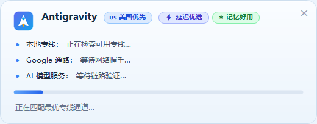
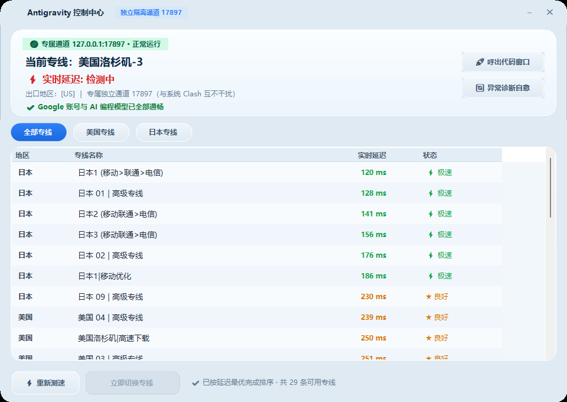

# Antigravity 智能启动器与无感自愈引擎 (Antigravity Recovery Launcher)

<p align="center">
  
</p>

<p align="center">
  <strong>专为 Google Antigravity AI 编程 IDE 打造的工业级自愈底座与启动入口</strong><br>
  微秒级无感热切换 · 首帧微任务零闪烁汉化 · 17897 独立沙盒隔离 · 多客户端订阅免配自发现
</p>

<p align="center">
  
  
  
  
  
</p>

---

## 🎯 痛点与初衷：为什么需要它？

在使用 Google Antigravity 进行沉浸式 AI 辅助编程时，开发者往往面临几类毁灭“心流”的痛点：
1. **网络断流与地区 400 阻断**：Google API 经常受到节点网络波动或地区策略变动的影响，导致正在生成的代码中断报错；
2. **传统工具粗暴杀进程**：市面上的重置或修复工具往往简单粗暴地通过任务管理器杀死编辑器进程，导致写到一半的代码、未保存的会话草稿和终端正在运行的任务全部付之一炬；
3. **汉化弹窗“翻页闪现”**：常规 DOM 翻译因防抖延迟，打开设置面板时会先显示 1 秒英文，再突然跳变刷新为中文，带来强烈的视觉撕裂感；
4. **跨设备配置繁琐**：换一台电脑，或者 Clash 客户端安装在 D 盘/自定义路径，普通脚本就会因为找不到路径而彻底罢工。

**Antigravity 智能启动器就是为了根治这些痛点而生——让用户只管专注于写代码，把所有复杂的网络调度、节点优选、状态核验和后台自愈全部默默做完。**

---

## 🌟 四大核心技术支柱

### 1. ⚡ 彻底终结杀编辑器：无感热切换与后台自愈 (Seamless In-Memory Failover)
* **进程生命周期神圣不可侵犯**：彻底废弃“杀进程重启”的陈旧逻辑。当专线断流、节点失效或用户主动点击切换时，系统仅在 `127.0.0.1:17897` 沙盒内部完成上游线路的**热漂移重路由 (Hot Drift)**；
* **编辑器零闪烁、不中断**：正在编写的代码、打开的文件、对话历史与终端任务**100% 保持常驻**；
* **极简双态感知胶囊**：编辑器已运行时，双击桌面图标呼出精致卡片：
  - **`进入代码窗口 (3s)`**：3 秒无操作自动聚焦编辑器窗口，不干扰专注；
  - **`⚡ 切换最优专线`**：动词先行，一键无感切换最优通道。

### 2. 🛡️ 17897 独立沙盒：零污染、零干扰 (Zero-Pollution Isolated Sandbox)
* **完全隔离日常上网**：启动器为 Antigravity 单独开辟 `127.0.0.1:17897` 独立端口，绝不占用、不修改用户日常使用的 Clash 端口（通常为 7897）；
* **不修改系统代理**：不开启 TUN 虚拟网卡，不篡改 Windows 系统的全局代理设置，日常网页浏览、游戏与下载完全不受任何影响。

### 3. 📡 多客户端订阅解耦雷达：全自动开箱即用 (Zero-Config Subscription Radar)
* **核心在于“订阅数据”，而非“安装路径”**：无论 Clash Verge Rev、Mihomo Party 安装在 C 盘、D 盘还是移动硬盘，启动器均直接穿透 Windows 规范的漫游目录 `%APPDATA%`，直接提取当前最新的订阅索引与节点缓存；
* **三级内核搜寻雷达**：依次穿透标准路径、系统环境变量 PATH 与 Windows 注册表 `Uninstall` 卸载记录，自动定位 Mihomo 内核，做到**零配置、跨电脑开箱即用**；
* **真实模型生成门禁 (Real Gemini Gate)**：不依赖虚假的 TCP Ping 或单纯的 HTTP 204。系统调用 Google 官方 `agy` 命令行发送探针，必须由 Gemini 模型真实返回 `OK` 才能放行。

### 4. 🚀 首帧微任务同步直译：彻底告别 1 秒翻页闪现 (Microtask Zero-Flicker)
* **微任务前置直译**：为设置面板（Settings Surface）和通用模态框专门设计极速通道（Fast-Path Pipeline）；
* **首帧即中文**：在 DOM MutationObserver 被触发的同一微任务时钟周期内立即完成中英文本替换，消除了防抖等待带来的闪现跳变，带来原生级别的平滑质感。

---

## 📸 界面展示 (Showcase)

| 热启动双态胶囊卡片 | 冷启动极速核验卡片 |
| :---: | :---: |
|  |  |
| *检测到编辑器运行时，3秒自动进入或一键热切专线* | *冷启动时执行毫秒级多维评分与真实 Gemini 探针* |

<p align="center">
  <br>
  <em>节点中控台全景：支持并发测速、延迟排序与手动一键切换</em>
</p>

---

## 🚀 极简上手与分发指南 (Quick Start & Distribution)

### 选项 A：绿色免安装版（推荐，解压即用）
1. 下载 `Antigravity-Windows-Recovery-Launcher-1.0.0-windows-x64.zip`；
2. 解压到目标电脑的任意目录（如 `D:\Tools\Antigravity`）；
3. 双击 `Antigravity-Recovery-Launcher.exe`（或 `Install.cmd`）：
   - 首次启动会自动在桌面创建 **`Antigravity 启动器.lnk`** 快捷方式；
   - 自动在后台接入 `Antigravity-AccountWatcher` 开机自愈守卫；
4. **之后每天只需双击桌面的 `Antigravity 启动器` 图标即可！**

### 选项 B：标准 Windows 安装向导版（适合小白用户）
1. 下载 `Antigravity-Windows-Recovery-Setup-1.0.0-windows-x64.exe`；
2. 双击后按照极简中文向导一路点击“下一步”，自动安装到 `%LOCALAPPDATA%\Antigravity\launcher` 并创建桌面快捷方式。

> 💡 **跨电脑迁移提示**：
> 只要目标电脑上安装有 Clash Verge Rev 或 Mihomo Party 并且导入过订阅，解压本工具后双击即可直接使用，无需重新配置节点！

---

## 🏗️ 架构拓扑 (System Architecture)

```text
桌面快捷方式 / 用户双击
       │
       ▼
┌─────────────────────────────────────────────────────────────┐
│             Antigravity-Recovery-Launcher.exe               │
│   (情境自感知：未开编辑器走冷启动胶囊；已开走 3s 双态胶囊)      │
└──────────────┬───────────────────────────────┬──────────────┘
               │ (未启动)                      │ (请求切换专线)
               ▼                               ▼
┌─────────────────────────────────────────────────────────────┐
│                 ProxySupervisor 核心调度引擎                 │
│  ├─ 多源订阅雷达：穿透 %APPDATA% 提取有效订阅节点 (完全解耦)  │
│  ├─ Smart Pool 智能评分：地区权重 + 延迟 RTT + 历史记忆     │
│  ├─ Gemini 官方真实探针：通过 Google agy CLI 验证真实生成    │
│  └─ 127.0.0.1:17897 独立沙盒：无感热接管 (不杀编辑器)       │
└──────────────┬───────────────────────────────┬──────────────┘
               │                               │
               ▼                               ▼
┌────────────────────────────────┐ ┌──────────────────────────┐
│   Google Antigravity 官方客户端 │ │  AccountWatcher 静默守卫 │
│  ├─ 独占 17897 专线隧道        │ │  ├─ 每 20 秒高频无感巡检  │
│  ├─ CDP 端口注入微任务直译内核  │ │  ├─ 日志游标防回绕机制    │
│  └─ 专注写代码，心流不中断      │ │  └─ 网络断流触发后台热愈  │
└────────────────────────────────┘ └──────────────────────────┘
```

---

## ❓ 常见问题解答 (FAQ)

### Q1: 我的 Clash 安装在 D 盘或者自定义路径，启动器能识别吗？
**能，100% 自动识别。**  
启动器要的核心是**订阅节点数据**，而不是软件本身。Windows 规范规定所有客户端的订阅缓存都存放在 `%APPDATA%` 中。启动器直接读取该目录，并通过 Windows 注册表雷达反查内核安装位置，与安装在哪个盘完全解耦。

### Q2: 这个工具会影响我平时的日常上网或代理软件吗？
**绝对不会。**  
启动器为 Antigravity 独占运行在 `127.0.0.1:17897` 独立端口。你平时的日常 Clash（通常是 7897 端口）无论开什么规则、切换什么节点，互相完全独立、零干扰。

### Q3: 写代码写到一半如果专线被 Google 阻断，会发生什么？
后台守卫（`AccountWatcher`）会在几百毫秒内在 17897 沙盒内无感切换到下一个最优专线。**你的编辑器窗口不会关闭，代码不会丢失**，就像没有发生过故障一样平稳过渡。

### Q4: 如何彻底卸载？
- 安装包版：在 Windows“设置” -> “已安装的应用”中点击卸载；
- 绿色解压版：运行目录下的 `uninstall.ps1` 即可完整清除快捷方式与自愈守卫。
- 卸载过程极为克制，绝不碰你的项目代码和 Google 登录态。

---

## 📚 详细文档导航

* 📖 [用户使用与跨设备分发手册](docs/USER_GUIDE.md)
* 🏛️ [系统架构与协同设计](docs/ARCHITECTURE.md)
* 💡 [设计哲学与工程边界](docs/DESIGN.md)
* 🛠️ [踩坑与故障排查手册](docs/TROUBLESHOOTING.md)
* 📋 [1.0.0 正式版发布说明](docs/RELEASE-NOTES-1.0.0.md)
* 📝 [完整版本演进记录](CHANGELOG.md)

---

## 📄 开源许可证

本项目基于 [MIT License](LICENSE) 开源发布。
