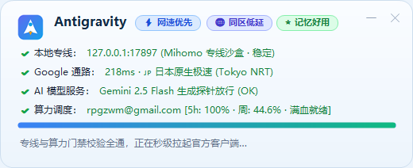

# Antigravity 智能启动器与无感自愈引擎

<p align="center">
  
</p>

<p align="center">
  <strong>专为 Google Antigravity 打造的工业级自愈底座与启动入口</strong><br>
  微秒级无感热切换 · 17897 独立沙盒隔离 · 首帧微任务零闪汉化 · 四级智能算力调度 · 多客户端订阅免配自发现
</p>

<p align="center">
  
  
  
  
  
  
</p>

---

## 🎯 痛点与初衷：为什么需要它？

在使用 Google Antigravity 进行沉浸式 AI 辅助编程时，开发者往往面临几类毁灭“心流”的痛点：

1. **网络断流与地区 400 阻断**：Google API 频繁受节点波动或地区策略变动影响，导致正在生成的代码中断报错；
2. **传统工具粗暴杀进程**：市面上的重置与切号工具往往简单粗暴地通过任务管理器杀死编辑器进程，导致写到一半的代码、未保存的会话草稿和终端正在运行的任务全部付之一炬；
3. **汉化弹窗“翻页闪现”**：常规 DOM 翻译因防抖延迟，打开设置面板时会先显示 1 秒英文，再突然跳变刷新为中文，带来强烈的视觉撕裂感；
4. **跨设备配置繁琐**：换一台电脑，或者 Clash 客户端安装在 D 盘/自定义路径，普通脚本就会因为找不到路径而彻底罢工；
5. **多账号夜间死锁与额度浪费**：切号工具若缺乏前置门禁，容易盲目切入被封禁、需网页申诉验证的坏号导致客户端卡死；若缺乏周期调度意识，还会出现周额度即将清零重置的账号被闲置、反而去消耗刚刷新的新号，造成宝贵算力白白浪费。

**Antigravity 智能启动器就是为了根治这些痛点而生——让开发者只管专注于写代码，把所有复杂的专线调度、节点优选、首帧汉化、多账号健康度巡检和后台无感自愈全部默默做完。**

---

## 🌟 五大核心技术支柱

### 1. ⚡ 彻底终结杀编辑器：无感热切换与后台自愈
* **进程生命周期神圣不可侵犯**：彻底废弃“杀进程重启”的陈旧逻辑。当专线断流、节点失效或需要轮换线路时，系统仅在 `127.0.0.1:17897` 沙盒内部完成上游线路的热漂移重路由；
* **编辑器零闪烁、不中断**：正在编写的代码、打开的文件、对话历史与终端任务**100% 保持常驻**；
* **极简双态感知胶囊**：编辑器已运行时，双击桌面图标呼出精致卡片：
  - **`打开继续使用 (3s)`**：3 秒无操作自动聚焦编辑器窗口，不干扰专注；
  - **`⚡ 网络自愈重连`**：平时一键无感切换最优通道，遇顽疾时彻底重置连接池与坏节点冷却隔离；
* **有界防抖守卫**：后台守护对地区 400 做有界处理，先防抖再轮换；真实断流按连续失败触发静默自愈，绝不反复震荡打扰用户。

---

### 2. 🛡️ 17897 独立沙盒：零污染、零干扰
* **完全隔离日常上网**：启动器为 Antigravity 单独开辟 `127.0.0.1:17897` 独立端口，绝不占用、不修改用户日常使用的 Clash 端口（通常为 7897）；
* **不修改系统代理**：不开启 TUN 虚拟网卡，不篡改 Windows 系统的全局代理设置，日常网页浏览、游戏与下载完全不受任何影响。

---

### 3. 📡 多客户端订阅解耦雷达：全自动开箱即用
* **核心在于“订阅数据”，而非“安装路径”**：无论 Clash Verge Rev、Mihomo Party 安装在 C 盘、D 盘还是移动硬盘，启动器均直接穿透 Windows 规范的漫游目录 `%APPDATA%`，直接提取当前最新的订阅索引与节点缓存；
* **三级内核搜寻雷达**：依次穿透标准路径、系统环境变量 PATH 与 Windows 注册表 `Uninstall` 卸载记录，自动定位 Mihomo 内核，做到**零配置、跨电脑开箱即用**；
* **真实模型生成门禁**：不依赖虚假的 TCP Ping 或单纯的 HTTP 204。系统调用 Google 官方 `agy` 命令行发送探针，必须由 Gemini 模型真实返回 `OK` 才能放行。

---

### 4. 🚀 首帧微任务同步直译：彻底告别 1 秒翻页闪现
* **微任务前置直译**：为设置面板和通用模态框专门设计极速通道；
* **首帧即中文**：在 DOM 变动的同一微任务时钟周期内立即完成中英文本替换，消除了防抖等待带来的闪现跳变，带来原生级别的平滑质感。

---

### 5. 🧠 四级智能算力调度、冷启动门禁与动态账号隔离
* **四级优先级智能调度算法**：
  1. **第 1 优先级：周额度到期时间（越近越好）**：剩余 2 天到期的账号绝对优先于剩余 6 天到期的账号使用，杜绝即将刷新的额度被清零浪费；
  2. **第 2 优先级：可用额度存量（>5% 且同梯队多者胜出）**：门槛需大于 5%（小于等于 5% 判定为濒死账号自动跳过），同到期梯队内额度更高者优先；
  3. **第 3 优先级：小时额度充沛（越满血越好）**：周额度相近时，优先调用 5 小时额度 100% 满血账号，保障会话爆发力；
  4. **第 4 优先级：异常状态一票否决**：提示需申诉、需网页二次验证或封禁账号扣除 100,000 分直接出局；
* **冷启动零信任前置门禁（Preflight Gate）**：
  - 启动编辑器前，前置校验当前账号健康度；若检测到当前账号处于失效或封禁状态，在拉起窗口前**0.2 秒后台原子切换至健康账号**，彻底根除启动落入坏号死锁；
* **动态黑名单隔离与一键解封（`--unblock`）**：
  - 支持将失效账号沉淀进动态黑名单；用户在网页端申诉成功或解除验证后，执行一条解封指令即可同时打通永久黑名单出狱、429关押释放与 Cockpit AES-GCM 账户重置，无缝回归可用算力池。

---

## 📸 界面展示

> 💡 **告别臃肿控制台**：软件全面精简为**“平时完全静默、唤醒仅见精致胶囊”**的心流交互设计：

| 热启动双态胶囊卡片 | 冷启动极速核验卡片（四行透明看板） |
| :---: | :---: |
|  |  |
| *检测到编辑器运行时：3秒自动进入或一键自愈重连* | *冷启动时呼出：专线沙盒 / Google链路 / 模型生成 / 算力账号四维透明自检* |

---

## 🚀 极简上手与分发指南

### 选项 A：绿色免安装版（推荐，解压即用）
1. 从 [最新发布页 (Releases)](https://github.com/zwmopen/Antigravity-Windows-Recovery-Launcher/releases/latest) 下载绿色免安装压缩包；
2. 解压到目标电脑的任意目录（如 `D:\Tools\Antigravity`）；
3. 双击 `Antigravity-Recovery-Launcher.exe`（或 `Install.cmd`）：
   - 首次启动会自动在桌面创建 **`Antigravity 启动器.lnk`** 快捷方式；
   - 自动在后台接入 `Antigravity-AccountWatcher` 开机自愈守卫；
   - 冷启动前置门禁自动核验专线通路与当前账号，秒级拉起官方客户端；
4. **之后每天只需双击桌面的 `Antigravity 启动器` 图标即可！** 如需绕过自愈门禁直接打开官方客户端，可使用同时维护的 `Antigravity 原版` 桌面快捷方式。

### 选项 B：标准 Windows 安装向导版（适合新手用户）
1. 从 [最新发布页 (Releases)](https://github.com/zwmopen/Antigravity-Windows-Recovery-Launcher/releases/latest) 下载标准安装包（`.exe`）；
2. 双击后按照极简中文向导一路点击“下一步”，自动安装到 `%LOCALAPPDATA%\Antigravity\launcher` 并创建桌面快捷方式。

> 💡 **跨电脑迁移提示**：
> 只要目标电脑上安装有 Clash Verge Rev 或 Mihomo Party 并且导入过订阅，解压本工具后双击即可直接使用，无需重新配置节点！

---

## 🛠️ CLI 运维与高级指令速查

系统内置了便捷的命令行管理工具，可在 `src\` 目录或运行时目录通过 `Antigravity-QuickSwitch.cmd` 快速执行高级运维操作：

| 指令 | 作用与功能说明 | 适用场景 |
| :--- | :--- | :--- |
| `.\Antigravity-QuickSwitch.cmd` | **智能平滑切号** | 依据四级算法计算全局最优账号并无感热切换 |
| `.\Antigravity-QuickSwitch.cmd --force` | **强制轮换至最优号** | 忽略当前状态，直接切至当前排名第一的账号 |
| `.\Antigravity-QuickSwitch.cmd --blocked` | **查看账号隔离看板** | 一览所有被系统关押、硬黑名单的账号清单与原因 |
| `.\Antigravity-QuickSwitch.cmd --unblock <邮箱>` | **一键解封账号** | 申诉或解除验证成功后，将账号释放回归算力池 |
| `.\Antigravity-QuickSwitch.cmd --block <邮箱> "原因"` | **手动拉黑隔离** | 人工临时或永久隔离异常账号，防止被调度切入 |
| `.\Antigravity-QuickSwitch.cmd --preflight-ensure` | **冷启动门禁核验** | 预检当前账号状态，遇坏号时自动在后台秒级自愈切换 |

---

## 🏗️ 整体架构拓扑

```text
桌面快捷方式 / 用户双击 / 开机冷启动
       │
       ▼
┌─────────────────────────────────────────────────────────────┐
│             Antigravity-Recovery-Launcher.exe               │
│  ├─ 零信任冷启动门禁 (Preflight Gate: --preflight-ensure)    │
│  │   └─ 当前账号健康核验：若为坏号/封禁，0.2s 后台原子切换  │
│  ├─ 启动看板：专线 / 链路 / 模型探针 / 算力四行透明看板     │
│  └─ 热启动感知：编辑器运行时提供 3s 自动进入 / 一键网络自愈 │
└──────────────┬───────────────────────────────┬──────────────┘
               │                               │
               ▼                               ▼
┌────────────────────────────────┐ ┌──────────────────────────┐
│   ProxySupervisor 专线调度引擎  │ │  SmartSwitch 算力调度中枢 │
│  ├─ 127.0.0.1:17897 独立沙盒   │ │  ├─ 四级智能优先级评分   │
│  ├─ 多源订阅雷达 (穿透%APPDATA%)│ │  ├─ 动态黑名单与一键解封 │
│  ├─ Gemini 官方真实探针放行    │ │  └─ Cockpit AES-GCM 同步 │
│  └─ 坏节点 Cooldown 淘汰       │ └──────────────────────────┘
└──────────────┬───────────────────────────────┘
               │
               ▼
┌────────────────────────────────┐ ┌──────────────────────────┐
│  Google Antigravity 官方客户端 │ │  AccountWatcher 静默守卫 │
│  ├─ 独占 17897 专线隧道        │ │  ├─ 每 20 秒高频无感巡检  │
│  ├─ CDP 注入首帧微任务汉化内核 │ │  ├─ 节点断流后台静默重路由│
│  └─ 进程常驻，代码与终端不丢失 │ │  └─ 拒绝粗暴杀主进程      │
└────────────────────────────────┘ └──────────────────────────┘
```

---

## ❓ 常见问题解答 (FAQ)

### Q1: 我的 Clash 安装在 D 盘或者自定义路径，启动器能识别吗？
**能，100% 自动识别。**  
启动器要的核心是**订阅节点数据**，而不是软件本身。Windows 规范规定所有客户端的订阅缓存都存放在 `%APPDATA%` 中。启动器直接读取该目录，并通过 Windows 注册表雷达反查内核安装位置，与安装在哪个盘完全解耦。

### Q2: 这个工具会影响我平时的日常上网或代理软件吗？
**绝对不会。**  
启动器为 Antigravity 独占运行在 `127.0.0.1:17897` 独立端口。你平时的日常 Clash（通常是 7897 端口）无论开什么规则、切换什么节点，互相完全独立、零干扰。

### Q3: 写代码写到一半如果专线被 Google 阻断，会发生什么？
后台守卫（`AccountWatcher`）每 20 秒在后台静默巡检，一旦感知到断流或地区封锁，会自动把故障节点打入冷宫（Cooldown），并在 17897 沙盒内无感切换到下一个最优专线。**你的编辑器窗口不会关闭，代码不会丢失**，平稳过渡。若遇极端异常，双击桌面卡片点击“⚡ 网络自愈重连”，1 秒彻底搞定！

### Q4: 之前被系统黑名单拦截的账号，申诉或验证回来后怎么放出来？
执行解封指令即可：
```bash
.\Antigravity-QuickSwitch.cmd --unblock <邮箱>
```
系统会自动执行“硬黑名单移除 + 429 临时关押池释放 + Cockpit 加密凭据清除错误标记恢复正常 + UI 刷新”四重联动，账号瞬间满血回到智能调度候选池中。随时可通过 `.\Antigravity-QuickSwitch.cmd --blocked` 查看当前隔离状态。

### Q5: 为什么要坚持“周到期时间越近越优先”？
Google Antigravity 的周额度按固定周期刷新，**未用完的额度到期即清零作废，不会累积**。  
假设账号 A 还有 2 天就重置，即使只剩 30% 额度，也应当优先消耗完毕；若此时去消耗刚重置（还有 6 天）的账号 B，2 天后账号 A 刷新，之前剩余的 30% 额度就彻底蒸发了。因此，优先使用即将重置的账号是算力价值最大化的核心策略。

### Q6: 如何彻底卸载？
- 安装包版：在 Windows“设置” -> “已安装的应用”中点击卸载；
- 绿色解压版：运行目录下的 `uninstall.ps1` 即可完整清除快捷方式与自愈守卫；
- 卸载过程极为克制，绝不碰你的项目代码和 Google 登录凭据。

---

## 📚 详细文档导航

* 📖 [用户使用与跨设备分发手册](docs/USER_GUIDE.md)
* 🏛️ [系统架构与协同设计](docs/ARCHITECTURE.md)
* 💡 [设计哲学与工程边界](docs/DESIGN.md)
* 🛠️ [踩坑与故障排查手册](docs/TROUBLESHOOTING.md)
* 📋 [2.9.1 正式稳定版发布说明](docs/RELEASE-NOTES-2.9.1.md)
* 📋 [1.5.0 正式稳定版发布说明](docs/RELEASE-NOTES-1.5.0.md)
* 📝 [完整版本演进记录](CHANGELOG.md)

---

## 📄 开源许可证

本项目遵循 [MIT 开源许可证](LICENSE)。

---

## 📝 变更记录

| 日期 (时间) | 执行者 | 记录 |
|---|---|---|
| 2026-10-01 08:35 | 反重力 | 全面重构中文 README.md：定位为全能启动器与自愈引擎全局说明书，有机融合五大核心支柱与解封体系 (v2.9.1) |
| 2026-09-18 23:41 | 反重力 | make antigravity cold startup enterable before login |
| 2026-09-17 23:11 | 💻 本地 PC / 反重力 | 初始化创建文档并补齐变更记录历史 |
