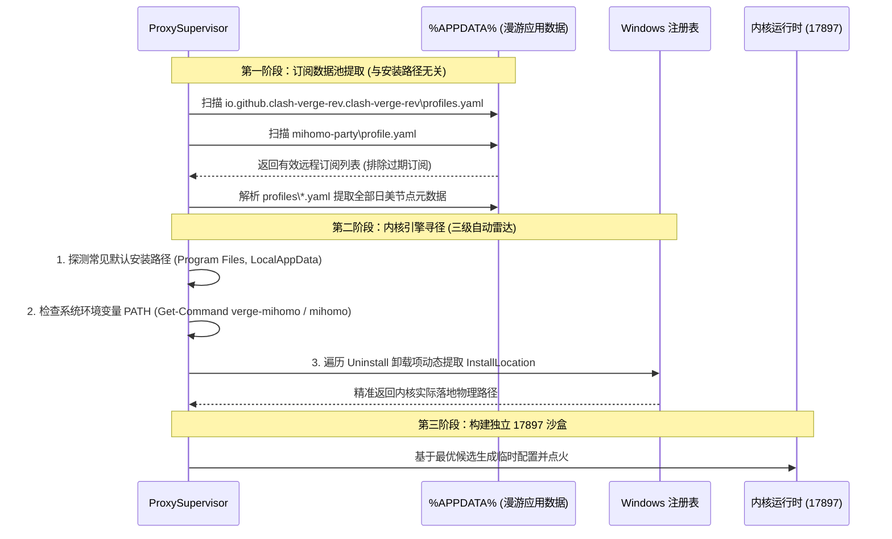

# Antigravity 智能启动器与自愈体系架构设计

本文档详细描述 **Antigravity 恢复启动器 (Antigravity Recovery Launcher)** 的全景系统架构、核心子系统协作模型与关键时序状态机。

---

## 1. 架构拓扑全景 (Architecture Topology)

```mermaid
graph TD
    User["用户操作 / 桌面快捷方式"] --> Launcher["Antigravity-Recovery-Launcher.exe (交互前端)"]
    
    subgraph Frontend ["前台感知与交互层"]
        Launcher -->|Antigravity 未运行| ColdForm["冷启动胶囊卡片 (极速核验进度)"]
        Launcher -->|Antigravity 已运行| HotForm["热启动胶囊卡片 (3s代码速切 / ⚡切换最优专线)"]
    end

    subgraph CoreEngine ["核心调度与控制层 (ProxySupervisor.ps1)"]
        ColdForm -->|执行冷启动| Supervisor["ProxySupervisor (核心调度引擎)"]
        HotForm -->|点击专线切换| Supervisor
        
        Supervisor --> SubRadar["多源订阅雷达 (零配置解析 %APPDATA%)"]
        Supervisor --> SmartPool["Smart Pool 智能评分与候选优选 (0~1000分)"]
        Supervisor --> ModelProbe["Gemini 官方模型真实探针 (agy CLI 真实生成门禁)"]
        Supervisor --> Sandbox["127.0.0.1:17897 独立沙盒网关"]
    end

    subgraph ClientLayer ["客户端接入与运行时 (Editor Runtime)"]
        Sandbox -->|无感热接管 (Hot Drift)| AGY["Google Antigravity 官方客户端 (PID 活跃)"]
        Supervisor -->|冷启动点火| AGY
        AGY --> CdpBridge["CDP 调试端口 (DevTools Bridge)"]
        CdpBridge --> I18nRuntime["首帧微任务直译引擎 (content.js)"]
    end

    subgraph SentinelLayer ["静默守护层 (AccountWatcher.exe)"]
        Watcher["Antigravity-AccountWatcher.exe (轻量静默守卫)"] -->|每20秒高频探测| Sandbox
        Watcher -->|网络阻断 / 地区 400| Supervisor
    end
```

---

## 2. 三大核心子系统协同职责

### 2.1 交互前端 (Antigravity-Recovery-Launcher.exe)
* **纯 C# / GDI+ 原生轻量开发**：零外部大型依赖，启动耗时 < 30ms，内存占用 < 8MB；
* **双态情境感知**：
  - **冷启动**：呼出半透明圆角胶囊卡片，实时投射专线检索、Google 通路握手与模型放行状态；
  - **热启动**：检测到 Antigravity 已在运行时，呼出极简双选胶囊，提供【进入代码窗口 (3s)】与【⚡ 切换最优专线】，绝不强杀编辑器进程；
* **防重入与多实例安全**：基于系统命名互斥体（Named Mutex），避免重复启动引发竞争。

### 2.2 核心调度引擎 (Antigravity-ProxySupervisor.ps1)
* **17897 独立沙盒生命周期管理**：以用户身份在 `127.0.0.1:17897` 拉起隔离代理实例，完全不影响用户日常 Clash（7897 端口）的正常使用；
* **无感热切换控制器 (Hot Drift Controller)**：
  - 当 Antigravity 已在运行（`antigravity_live_seamless_attached`），专线切换仅在 17897 沙盒内部更新上游代理链路；
  - 严格限制进程重启仅在冷启动或编辑器死锁黑屏时发生，保障用户写代码的心流不被打断；
* **硬核模型门禁**：不仅测试 HTTP 204 和 OAuth 连通性，更调用 Google 官方 `agy` 命令行发送探针，以模型真实返回 `OK` 作为专线合格的唯一准入标准。

### 2.3 静默守护神 (Antigravity-AccountWatcher.exe)
* **高频低耗巡检**：作为独立守护进程驻留后台，每 20 秒经由 17897 隧道对 Google 核心通路进行静默心跳探测；
* **抗回绕与事件收敛**：通过精密的日志偏移游标（Language Log Offset）与 3 次指数退避算法，彻底杜绝误判风暴与循环自愈；
* **无感触发**：当检测到网络硬截断或地区受阻时，在后台静默通知调度引擎完成热漂移自愈。

---

## 3. 订阅发现与内核搜寻雷达机制 (Zero-Config Discovery)

很多传统脚本强依赖硬编码路径，导致换一台电脑或装在 D 盘就彻底失效。本项目设计了**数据与程序解耦的三层雷达架构**：



---

## 4. 汉化核心：首帧微任务同步直译 (Microtask Fast-Path)

为了消除传统 DOM 轮询或后置防抖导致的“一秒翻页闪烁感”，扩展运行时重构为**双轨渲染机制**：

1. **常规流水线 (Normal Pipeline)**：
   用于大面积长列表与高频渲染视图，采用 80ms 尾部防抖 + 300ms 最大等待时间，保护 React 虚拟列表中的代码高亮、终端输出与会话消息；
2. **极速通道 (Fast-Path Pipeline)**：
   专门针对设置弹窗（Settings Surface）和通用模态框（Modal）。通过 `isInstantUiNode` 判定关键元素，在 DOM MutationObserver 回调被触发的同一微任务周期内立即执行同步替换，使界面呈现时已完全是中文，实现“首帧即汉化”的无感视觉体验。

---

## 5. 安全与隐私约束

* **回环绑定**：所有隧道严格绑定在 `127.0.0.1` 本地回环地址，严禁暴露局域网（LAN）或外部接口；
* **脱敏日志**：`launcher-error.log` 与 `supervisor.log` 对所有订阅 URL、节点密码、UUID、Token 和账号凭据执行严格的正则表达式清洗与脱敏；
* **零侵入原则**：绝对不破坏 Antigravity 的二进制主体，不碰官方 `resources\app.asar`，不导出用户 Google 授权密钥，不篡改日常 Clash 配置。
